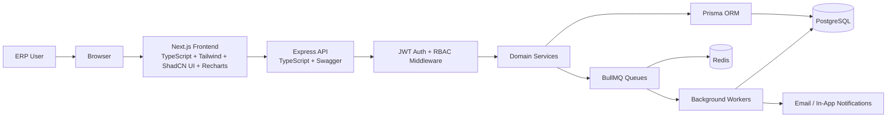
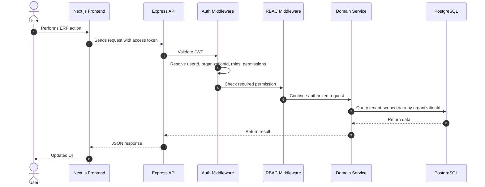
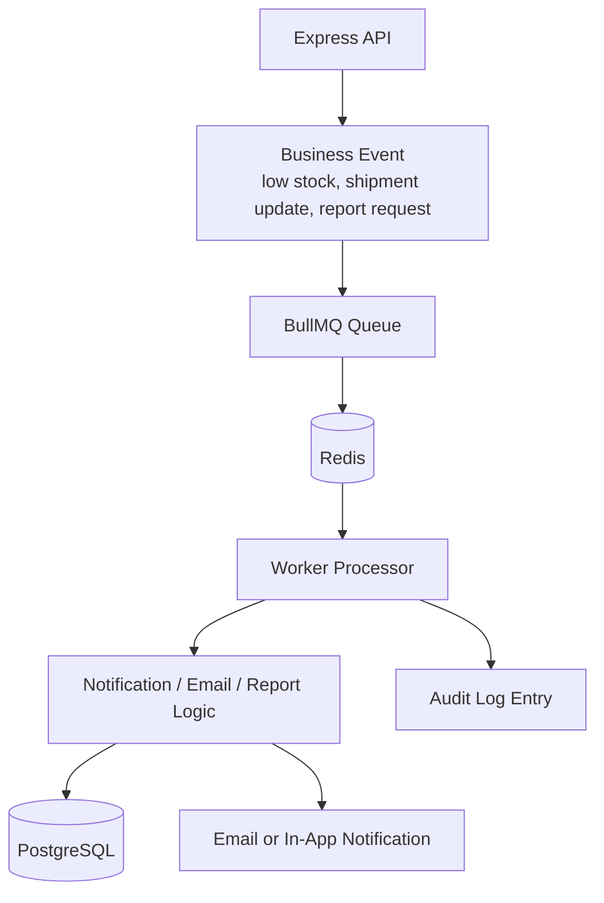
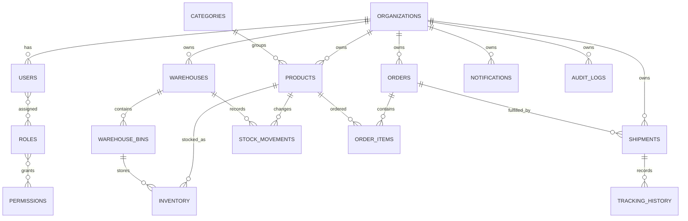
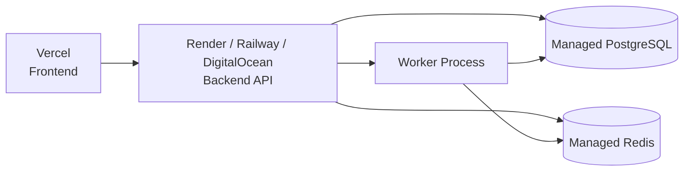

# System Architecture

## High-Level Architecture

## Request and Auth Flow

## Background Job Flow

## Core ERP Data Relationships

## Deployment Shape

Current local development uses Supabase PostgreSQL and Upstash-compatible Redis connection strings through environment variables. Production deployment is still planned separately.
